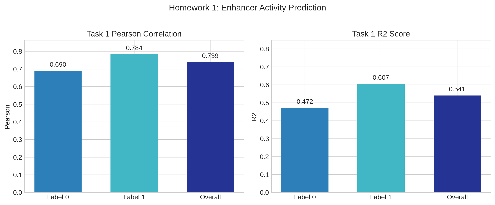
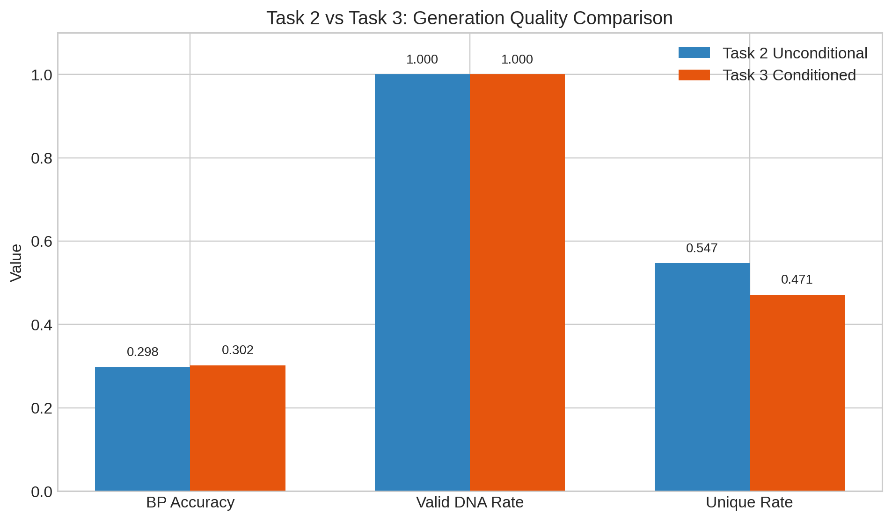
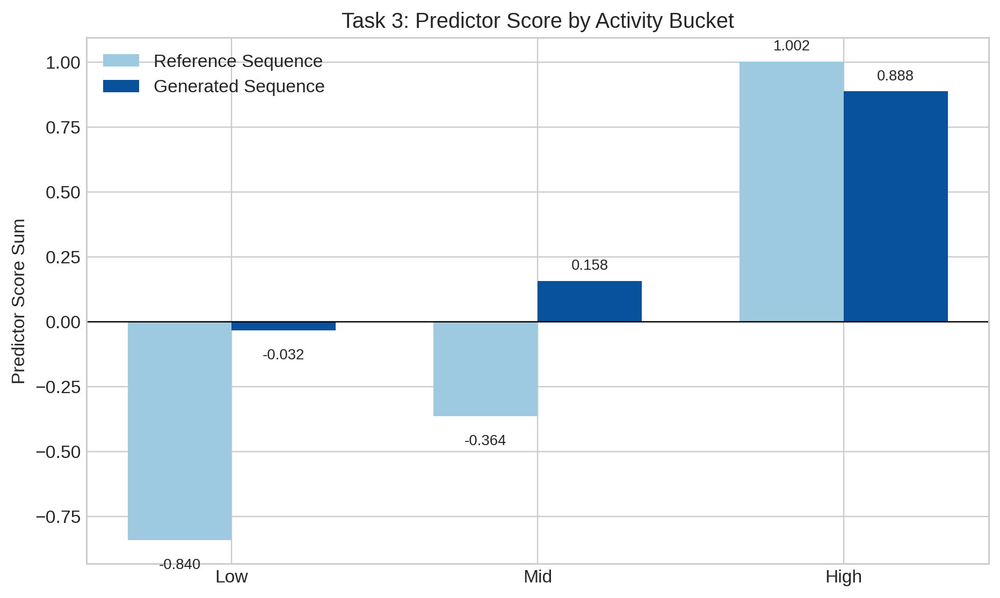
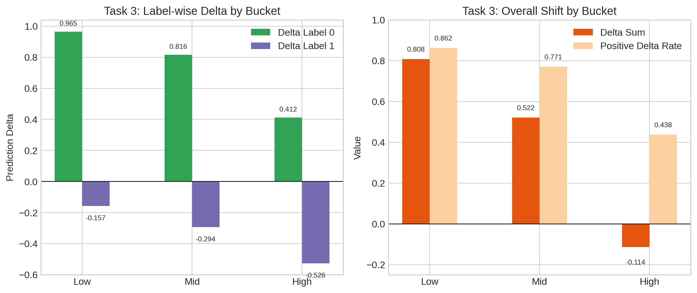

# 基于 GENERator 的 DeepSTARR 增强子建模实验报告

## 1. 实验目标

本次实验围绕 DeepSTARR 增强子数据集和 `GENERator-eukaryote-1.2b-base` 模型展开，共完成三个任务：

1. 作业一：增强子活性预测  
   输入 `sequence`，输出二维活性 `label`，属于回归微调任务。
2. 作业二：增强子序列生成  
   仅使用 `sequence` 做自回归 SFT，训练无条件 enhancer generator。
3. 作业三：可控增强子序列生成  
   先将活性划分为 `high / mid / low` 三档，再使用控制 token 训练条件生成模型，并使用作业一训练得到的 predictor 对生成结果进行打分分析。

## 2. 数据与模型

### 2.1 数据集

- 数据集：`DeepSTARR-enhancer-activity`
- 输入列：`sequence`
- 标签列：`label`
- 划分方式：`train / valid / test`

### 2.2 预训练模型

- 基础模型：`GENERator-eukaryote-1.2b-base`
- tokenizer：DNA k-mer tokenizer
- 作业三使用的控制 token：
  - `<sp0>` 对应 `low`
  - `<sp1>` 对应 `mid`
  - `<sp2>` 对应 `high`

## 3. 方法概述

### 3.1 作业一：增强子活性预测

将 enhancer `sequence` 输入模型，预测二维连续值 `label`。训练时在 `train` 集上进行微调，在 `valid` 集上选取最佳 checkpoint，最终在 `test` 集上报告 Pearson correlation、R² 等指标。

### 3.2 作业二：无条件序列生成

只使用 enhancer `sequence` 进行自回归微调，使模型学习从前缀生成后续 DNA 序列。评测时从验证集序列中截取前缀作为 prompt，要求模型生成后续片段，并统计生成质量相关指标。

### 3.3 作业三：可控序列生成

先根据训练集活性分位数，将样本分为 `high / mid / low` 三档，再将控制 token 与 DNA 序列拼接形成 `conditioned_sequence`。训练完成后，在验证集上按控制条件生成序列，并使用作业一的 predictor 对生成结果进行后验打分，分析是否具备 controllability。

## 4. 实验结果

### 4.1 作业一：增强子活性预测结果

作业一最终测试集结果如下：

| 指标 | 数值 |
| --- | ---: |
| `test_pearson_label_0` | 0.6904 |
| `test_pearson_label_1` | 0.7845 |
| `test_pearson` | 0.7392 |
| `test_r2_label_0` | 0.4716 |
| `test_r2_label_1` | 0.6065 |
| `test_r2` | 0.5407 |
| `test_loss` | 0.4767 |

补充信息：

- 最优 checkpoint：`checkpoint-12572`
- 选模指标：`eval_pearson`

结果表明，该 predictor 对两个活性维度都具备较好的拟合能力，其中对第二个维度的学习效果更好。

**图 1 作业一回归性能图**

### 4.2 作业二：无条件生成结果

作业二在验证集上的生成结果如下：

| 指标 | 数值 |
| --- | ---: |
| `mean_bp_accuracy` | 0.2979 |
| `valid_dna_rate` | 1.0000 |
| `unique_rate` | 0.5469 |
| `exact_match_rate` | 0.0000 |

结果说明：

- `valid_dna_rate = 1.0`，说明模型能够稳定生成合法 DNA 字符；
- `mean_bp_accuracy ≈ 0.30`，说明模型已经学到一定的局部续写模式；
- `unique_rate ≈ 0.55`，说明生成结果具有一定多样性，但已经开始出现模式收缩。

### 4.3 作业三：条件生成结果

作业三在验证集上的生成结果如下：

| 指标 | 数值 |
| --- | ---: |
| `mean_bp_accuracy` | 0.3019 |
| `valid_dna_rate` | 1.0000 |
| `unique_rate` | 0.4714 |
| `exact_match_rate` | 0.0000 |

与作业二相比可以观察到：

- 生成合法性没有下降；
- `mean_bp_accuracy` 略有提升；
- `unique_rate` 下降，说明条件生成更加保守，diversity 有所减弱。

**图 2 作业二与作业三生成质量对比图**

### 4.4 作业三：基于 predictor 的 controllability 评测

使用作业一训练得到的 predictor 对作业三生成结果进行打分，得到如下整体统计：

| 指标 | 数值 |
| --- | ---: |
| `mean_generated_prediction_label_0` | 0.6184 |
| `mean_reference_prediction_label_0` | -0.1386 |
| `mean_prediction_delta_label_0` | 0.7570 |
| `mean_generated_prediction_label_1` | -0.3321 |
| `mean_reference_prediction_label_1` | -0.0191 |
| `mean_prediction_delta_label_1` | -0.3130 |
| `mean_generated_prediction_sum` | 0.2863 |
| `mean_reference_prediction_sum` | -0.1577 |
| `mean_prediction_delta_sum` | 0.4440 |
| `positive_delta_rate` | 0.7135 |

分 bucket 统计如下：

| Bucket | 生成序列平均得分和 | 参考序列平均得分和 | 平均得分变化 | 正向提升比例 |
| --- | ---: | ---: | ---: | ---: |
| `high` | 0.8881 | 1.0025 | -0.1144 | 0.4375 |
| `mid` | 0.1577 | -0.3642 | 0.5218 | 0.7709 |
| `low` | -0.0324 | -0.8404 | 0.8080 | 0.8624 |

上述结果有两个重要现象：

1. `high > mid > low` 的排序关系仍然成立，说明模型已经学到一定的 controllability。
2. 但控制效果还不够干净。当前模型主要把 `low` 和 `mid` bucket 往更高分方向推移，而 `high` bucket 反而略有下降。

进一步看 label 维度：

- `label_0` 的平均变化为正，提升较明显；
- `label_1` 的平均变化为负，说明当前模型更像是在沿某一个维度优化，而不是同时兼顾两个活性维度。

**图 3 作业三不同 bucket 的 predictor 打分图**

**图 4 作业三不同 bucket 的 delta 分析图**

## 5. 结果分析

### 5.1 成功之处

- 作业一训练出了一个质量较好的 DeepSTARR predictor，可以作为后续生成任务的评估器。
- 作业二已经能够稳定生成合法 DNA，说明无条件生成链路是可用的。
- 作业三已经出现了初步 controllability 信号，证明条件 token 方案具有可行性。

### 5.2 当前不足

- 作业二的续写准确率仍然有限，生成器整体还比较基础。
- 作业三虽然保住了 `high > mid > low` 的排序，但没有做到严格、稳定的三档控制。
- 当前条件生成主要抬高了 `label_0`，同时损伤了 `label_1`，说明条件设计仍有改进空间。
- 条件生成下 `unique_rate` 下降，说明多样性有所退化。

## 6. 结论

本次实验完成了 DeepSTARR 场景下的增强子活性预测、无条件序列生成和条件序列生成三项任务。作业一取得了 `test_pearson = 0.7392` 的回归结果，可作为稳定的后验评分器；作业二成功训练出可以生成合法 DNA 的 enhancer generator；作业三则进一步展示了基于 bucket token 的初步可控生成能力。后续工作可以围绕以下方向展开：

- 提升作业二生成 fidelity 与 diversity；
- 让作业三在 `high / mid / low` 三档之间形成更清晰的分布分离；
- 优化条件目标，使模型同时兼顾两个活性维度，而不是主要偏向 `label_0`。

